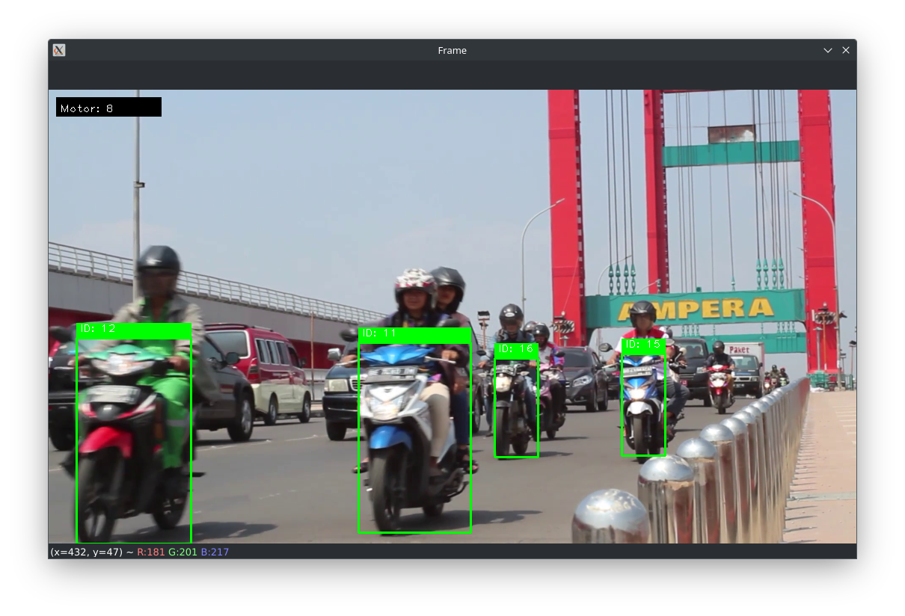

<<<<<<< HEAD
# Motorcycle Detection using OpenCV + YOLOv8
This project is a motorcycle detection, tracking and counter using YOLOv5 and Deep SORT. The model is trained using [this dataset](https://universe.roboflow.com/magang-bascorro-zbh9t/mobil-motor-and-plat/dataset/1).



## Requirements
- Python >= 3.8
- PyTorch >= 1.8
- ultralytics
- opencv-python
- deep-sort-realtime

## Installation
```bash
$ git clone
$ cd MotorDetectionPy
$ pip install -r requirements.txt
```

## Usage
Using Webcam
```bash
$ python program.py
```

Using Video
```bash
$ python program.py --video input/input.mp4
```

Using Image
```bash
$ python program.py --gambar input/gambar.jpg
```
